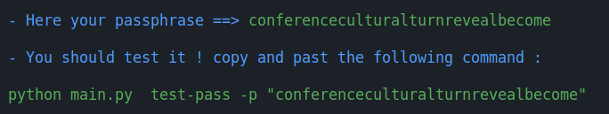
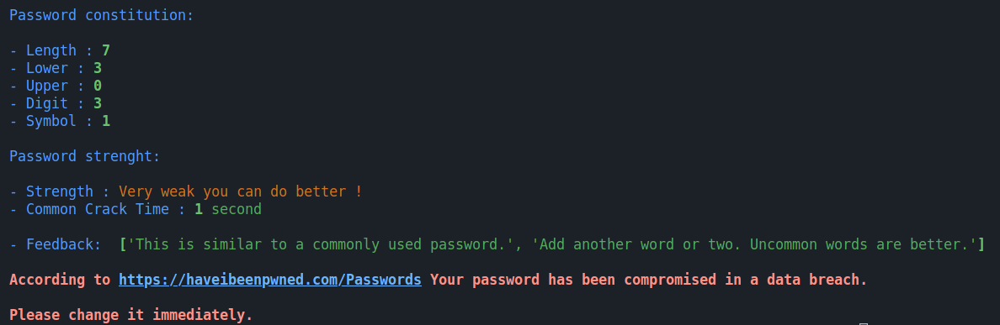
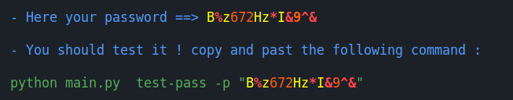
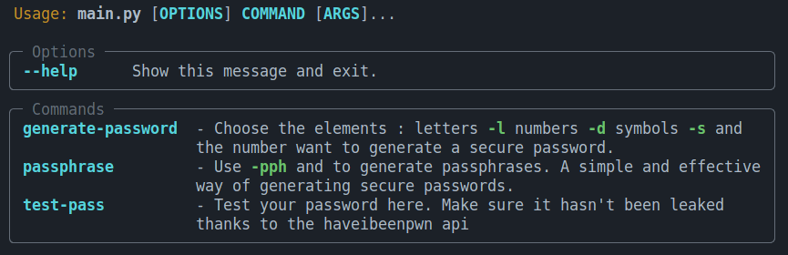

# A Password Strength Checker

This is a simple command-line interface (CLI) tool designed to assess the strength of passwords and determine if they need to be changed. You can also generate strong passwords with it. The tool utilizes two important components:

## Main Tools Used:
 
- **zxcvbn lib**
  - The zxcvbn Python library, developed by Daniel Lowe and Dropbox, is utilized to evaluate the strength of passwords. It provides an estimation of the time it would take to crack a password using various techniques. 

  - The library also incorporates a password strength algorithm that analyzes the complexity of a given password. By leveraging this library, the tool can accurately assess password strength, reinforcing overall security.

- **Have I Been Pwned API**
  - The Have I Been Pwned API exposes an endpoint: "GET https://api.pwnedpasswords.com/range/{first 5 hash chars}". 

  - This endpoint enables users to verify if a password has been compromised in any past data breaches. The API operates by accepting the first five characters of a password's SHA-1 hash. 

  - In response, it returns a list of hash suffixes that match the provided initial characters. By comparing the remaining hash of a user's password with the returned suffixes, individuals and organizations can identify if their password has been compromised. Implementing this feature bolsters password security and fortifies protection against common security breaches.

<p align="center">By incorporating the zxcvbn library and the Have I Been Pwned API, this project provides an efficient and reliable password strength checking mechanism.</p>


## Quick view
- Choose how many words in your passphrase
```python
    python3 main.py passphrase -pph 5
```



- Test any passwords

```python
    python3 main.py test-pass "@abc123"
```



- Generate personalized password
```python
    python3 main.py generate-password -l 5 -d 4 -s 5
```



- Main help or with any commands : 
```python
    python3 main.py --help
```


## Installation:

- This project runs on Python 3.10.
Clone the project:
```bash
    git clone https://github.com/LGD-P/P10_Open_C.git
```

- Manage dependencies:
```bash
    pip3 install poetry
```
- Activate the environment:
```bash
    poetry shell
```

- Install dependencies:
```bash
    poetry install
```

- Dont like poetry ? use requirements.txt file: 